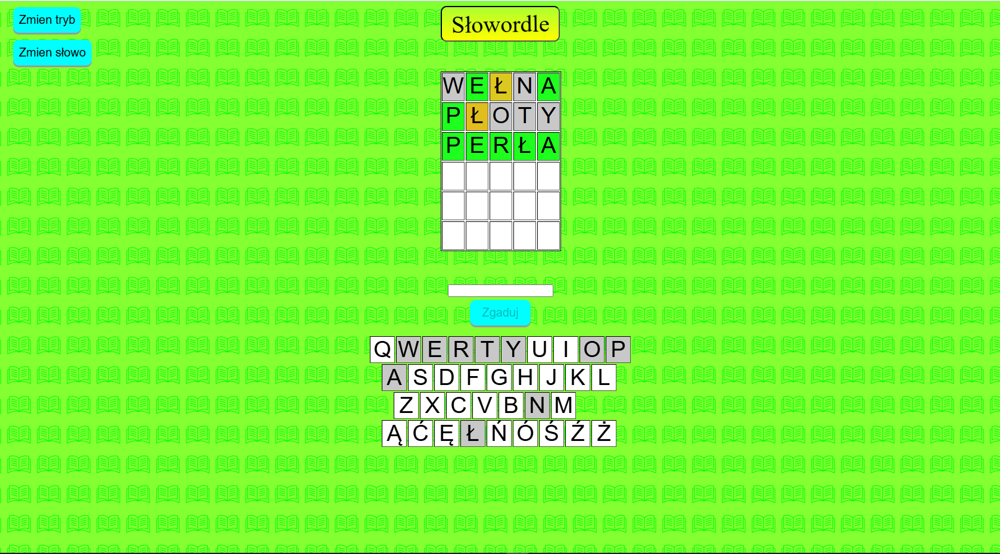

Przykładowy obraz strony

Jak uruchomić?
1. zainstalować program xampp
2. Wkleic folder "projekt" do "C:\xampp\htdocs"
3. uruchomic xampp
4.  w xamppie uruchomic mysql i apache
5. kliknąć na "admin" przy mysql
6. stworzyć bazę danych "wordl" i zimportować plik wordl.sql
7. wejsc na link http://localhost/projekt/
8. powinno się wyświetlić coś w stylu obrazku powyżej